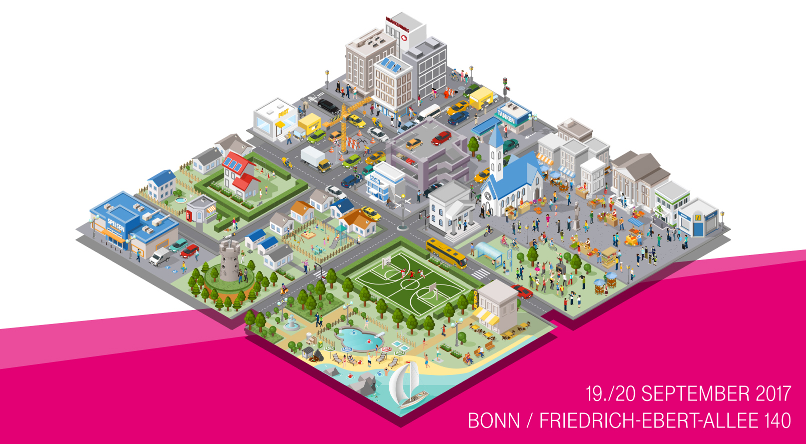

# #dthack18: Wifi Trackathon

## What is it about?
How can WiFi device data be used sensibly for life in the city of the future? Whether developer or designer - we are looking for you! **The winner will receive 1,000 euros, the second-placed 500 euros and the third-placed 250 euros**.   

This 24-hour hackathon (13.09.2018, 09:00 – 14.09.2018, 13:00) is all about how mobility data from citizens in cities can be collected and used to optimize life on public roads. Here we are talking about real cases of cities that can already be used tomorrow with your help.  

We are looking for interested developers and designers who would like to work together on defined challenges. The results will be presented directly in the following week (17.09.) to invited city representatives, mayors, designers.  

The challenges at a glance:
* **Challenge 1**: How can public transport companies (bus and train) use WiFi monitoring to measure the mobility flow of their passengers (KPI: how many people in the car, length of stay, transfer passengers, line, location, in/out)?
* **Challenge 2**: How can the city use WiFi monitoring to measure traffic flow and optimize planning (KPI: pedestrian, bicycle, car)?
* **Challenge 3**: How can motion flows be visualized based on WiFi positioning of smartphones and made usable for urban planning (KPI: map heatmap, dwell time on site)?
* **Challenge 4**: How can mesh networks support data transfer between the sensor nodes (KPI: n sensor nodes with high data throughput in a mesh network - but only one node with cloud connection)?  

Are you ready for these challenges? Then secure now one of the limited places for the first and best trackathon of all time!  

Deadline for registration: **Sunday, 09 September 2018**

Participation and meals (food and drink) are free of charge. Arrival is at your own expense.
Further information can be found here:
https://www.telekom.com/de/konzern/themenspecials/special-trackathon

## Dokumentation
Examples and documentation for the Deutsche Telekom Hackathon on 13/14 September in Bonn

## FAQ
* **Is the Hackathon open source?**  
  Yes, the data and software you use during the hackathon are completely open source.  
* **When and where will the Hackathon take place?**  
  Event start: Thursday, September 14, 2017 at 09:00 a.m.
  Event end: Friday, September 14, 2017 at approx. 01:00 p.m.
  Event location:
  Deutsche Telekom AG Headquarters
  Friedrich-Ebert-Allee 140
  53113 Bonn, Germany
* **What is the topic of the hackathon?**  
  This time, the topic is IoT (Internet of Things): The focus is on connected life in the city (Smart Public Life). IoT boards, sensors, and everything the IoT heart desires. The mission is: to make life in the city more convenient, simpler, and more livable for citizens. But without reinventing the smart street light for the thousandth time.
* **Who can take part?**
  * Professional developers
  * Trainee developers
  * Designers and concept developers
  * All inexperienced developers (newbies) with an interest in programming
* **I'm not a developer - what can i do to contribute to the Hackathon?**
  * **As a inexperienced developer (newbies):**  
  We also have IoT boards for you to work with. You will be given an introduction to the IoT board on site by an expert, who will be available to you at all times during the hackathon as a contact. In addition, you will have designers and concept developers by your side to develop and implement a great idea.
  * **As a designer/concept developer:**  
  You can support a team in the 24-hour hackathon: starting with the ideation phase, which you will lead, through to implementation of your idea design.  
  You can support newbies in the ideation phase, help them refine their ideas in the development phase and get them fit for the presentation of results.
* **Who covers the cost of the event?**  
  It's free to take part in the hackathon, and the costs of food and hardware, such as the IoT boards and sensors on site are covered. The travel expenses must be covered by your own.

## License
All documentation and examples for the Deutsche Telekom Hackathon 2018 ([**#dthack18**](https://twitter.com/hashtag/dthack17)) are distributed under the conditions of the MIT license. For details see the [LICENSE file](LICENSE).
